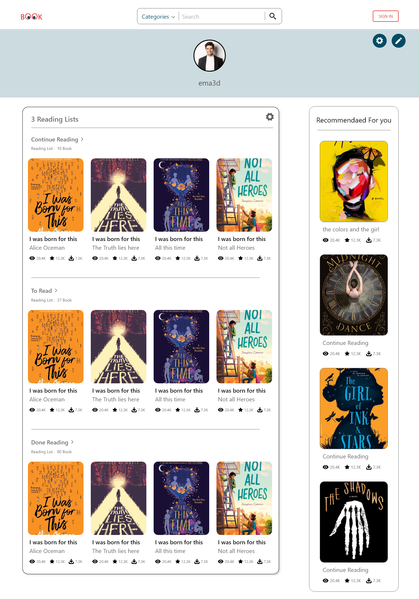

# Book

The project is part of React Nanodegree graduation requirements. The app is divided into two pages home page holds three shelves currently reading, want to read, and read. users are able to move books between them in addition, there is a link to the search page. users also can search for books and add them to the desired shelf. and in turn, they can go to shelves again by the provided link.

## Install

```
npm install
```

## Run

```
npm run dev
```

## Approach And Steps Taken

- split functionalities into features and components.
- decide which data is needed by each component.
- built search functionality by consuming search API endpoint
- Ensured the app doesn't break if the book list not returned
- Built Shelves page and functionality
- Ensure that users can move books between pages and that the UI was updated immediately.
- link Shelves to search and vice versa
- work a bit on the style.

## Technologies and dependencies used

1. react
2. react-dom
3. react-redux
4. react-router-dom
5. @reduxjs/toolkit
6. vite

## Future Considerations

In the soon future I am going to rebuild this project with new UI design and more functionality there will be more free time available.

## The future design Look



## Contributor

### Saber Kassem Ali [LinkedIn](https://www.linkedin.com/in/ablaze-arrow/) [Twitter](https://twitter.com/ablazeArrow)

## License

### MIT
